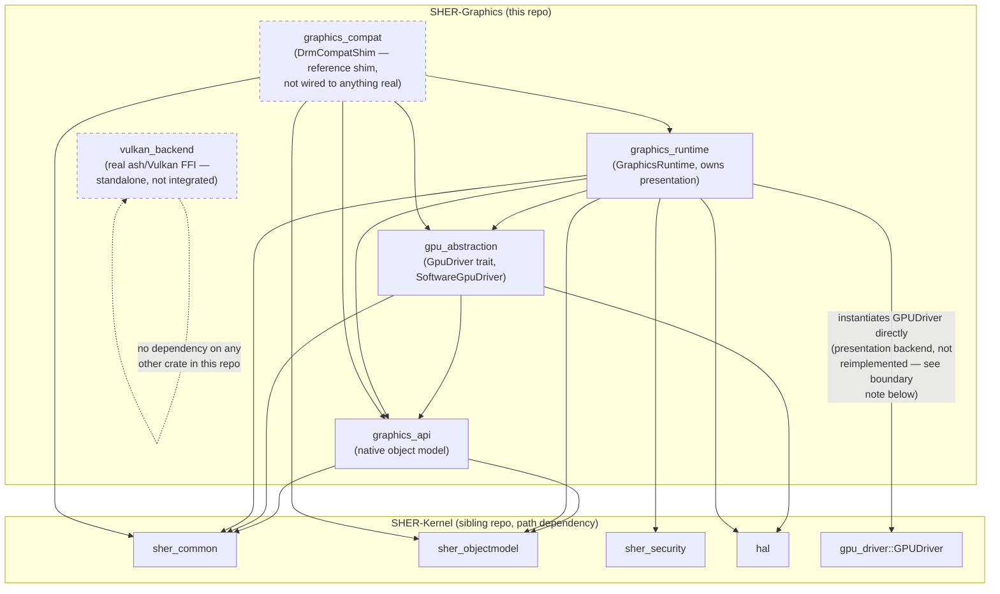
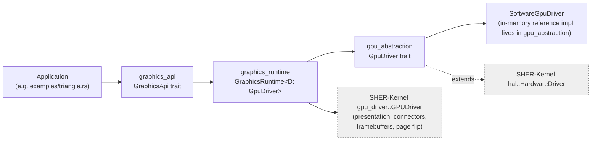

# Architecture — as-built

This page is the **as-built** counterpart to [`../../ARCHITECTURE.md`](../../ARCHITECTURE.md),
which is a much larger design document covering both what's implemented
and what's still just planned (it says so explicitly in its own "Status"
line). This page only diagrams what exists in the repository today,
verified by building/testing it, not what's designed for later.

For the full design rationale — why native-first instead of
Vulkan-first, the Mesa integration strategy, the LKI driver-hosting
migration path, the security/capability model — see `ARCHITECTURE.md`.
For a plain list of what's tested vs. not built at all, see
[`../../ROADMAP_HONEST.md`](../../ROADMAP_HONEST.md).

## Crate dependency graph (as-built)

Dashed borders mark crates that are real but **not wired into the rest of
the stack**: `vulkan_backend` has zero Cargo dependency on any other crate
in this repo (by design — see its module docs), and `graphics_compat`'s
`DrmCompatShim` wraps `graphics_runtime` but nothing outside its own test
suite calls it yet.

## Runtime layering and the SHER-Kernel boundary

**Boundary rule, verified for this pass:** `graphics_runtime` is the only
place in this repo that instantiates `gpu_driver::GPUDriver`
(`crates/graphics_runtime/src/lib.rs:143`,`:149`). That type is *defined*
once, in `SHER-Kernel/crates/gpu_driver/src/lib.rs:65` — SHER-Graphics
consumes it for presentation (connectors/framebuffers/page-flip), it does
not redefine or reimplement kernel-level GPU driver responsibilities.
Downstream, `SHER-Display` deliberately does **not** instantiate
`GPUDriver` itself — it consumes only value types from this repo — so the
kernel's own driver type has exactly one owner-that-instantiates-it across
the whole family. This is the boundary discipline the SHER family is
built around; if that ever changes (e.g. a second crate starts calling
`GPUDriver::new`), treat it as an architecture regression, not a
refactor.

## What each layer actually does today

| Layer | Real, tested | Not real |
|---|---|---|
| `graphics_api` | Object model, `GraphicsApi` trait | — |
| `gpu_abstraction` | `GpuDriver` trait, `SoftwareGpuDriver` (multi-GPU, VRAM accounting, fault injection) | No real hardware driver implements `GpuDriver` |
| `graphics_runtime` | Full submit/validate/present pipeline against `SoftwareGpuDriver`; real presentation bridge to `gpu_driver::GPUDriver`; capability enforcement; driver-panic containment | Presentation bridge has never been exercised against real display hardware — `gpu_driver` itself is a DRM/KMS-shaped simulation in SHER-Kernel |
| `graphics_compat` | Object-id-level request/response shapes matching real DRM ioctl semantics, tested against `SoftwareGpuDriver` | `ModeGetResources` always returns empty; `PrimeHandleToFd` returns an `ObjectId`, not a real fd; nothing calls this crate outside its own tests |
| `vulkan_backend` | Real device enumeration + offscreen clear-color render against a real Vulkan ICD | Not reachable from any other crate in this repo |
